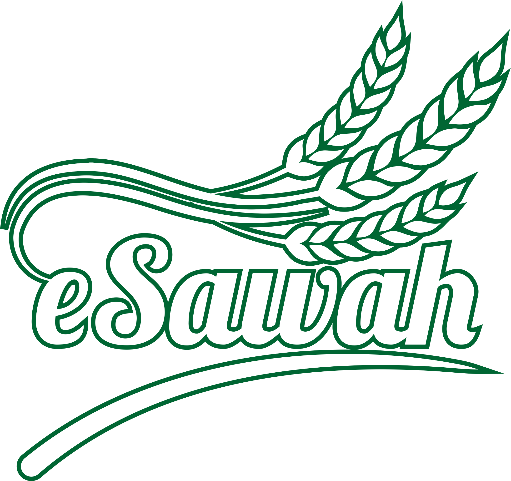

## About esawah

<b>esawah</b> adalah aplikasi manajemen penyewaan sawah berbasis web.

## Next Fitures 2.0.1

<b><i>Fitur For 2.0.1</i></b>
<ul>
<li>CRUD Pawongan</li>
<li>CRUD Lanja</li>
<li>CRUD Pajak</li>
<li>CRUD Zakat</li>
</ul>

## Changelogs

<b><i>v2.0.0</i></b>
<ul>
<li><b>New</b> Laravel v9</li>
<li><b>New</b> Livewire v2</li>
<li><b>New</b> Bootstrap v5 UI</li></del>
<li><b>New</b> Fontawesome v6</li>
<li><b>New</b> Bootstrap Icon v1.8</li>
<li><b>New</b> Spatie Permission V5</li>
<li><b>New</b> Admin LTE v3.2.0</li>
<li><b>New</b> startbootstrap.com</li>
<li><b>New</b> jantinnerezo/livewire-alert</li>
<li><b>New</b> uxsolutions/bootstrap-datepicker</li>
<li><b>New</b> leafletjs.com</li>
<li><b>New</b> ljagis/leaflet-measure</li>
<li><b>New</b> leaflet-googlemap</li>
</ul>

## Packages

- **[Laravel 9](https://laravel.com/docs/9.x/releases)**
- **[Livewire 2](https://laravel-livewire.com/docs/2.x/quickstart)**
- **[Bootstrap 5](https://getbootstrap.com/docs/5.1/getting-started/introduction/)**
- **[Fontawesome 6](https://fontawesome.com/icons)**
- **[Bootstrap Icon 1](https://icons.getbootstrap.com/#icons)**
- **[Spatie Permission 5](https://spatie.be/docs/laravel-permission/v5/introduction)**
- **[Admin LTE 3](https://github.com/ColorlibHQ/AdminLTE)**
- **[Grayscale Template](https://startbootstrap.com/theme/grayscale)**
- **[jantinnerezo/livewire-alert](https://github.com/jantinnerezo/livewire-alert)**
- **[uxsolutions/bootstrap-datepicker](https://github.com/uxsolutions/bootstrap-datepicker)**
- **[leafletjs.com](https://leafletjs.com/)**
- **[ljagis/leaflet-measure](https://github.com/ljagis/leaflet-measure/)**
- **[leaflet-googlemap](https://stackoverflow.com/questions/9394190/leaflet-map-api-with-google-satellite-layer)**
- **[hallindavid/manny](https://github.com/hallindavid/manny)**

## License

eSawah is open-sourced software licensed under the [MIT license](https://opensource.org/licenses/MIT).

## Developer

Aplikasi ini dibuat oleh  [M. Ade Erik](mailto:ozonerik@gmail.com)
